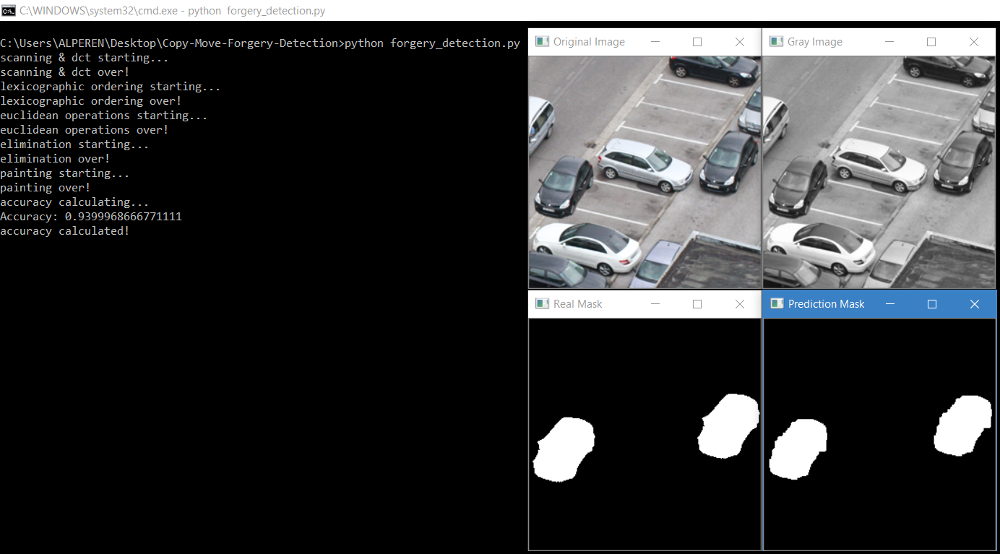
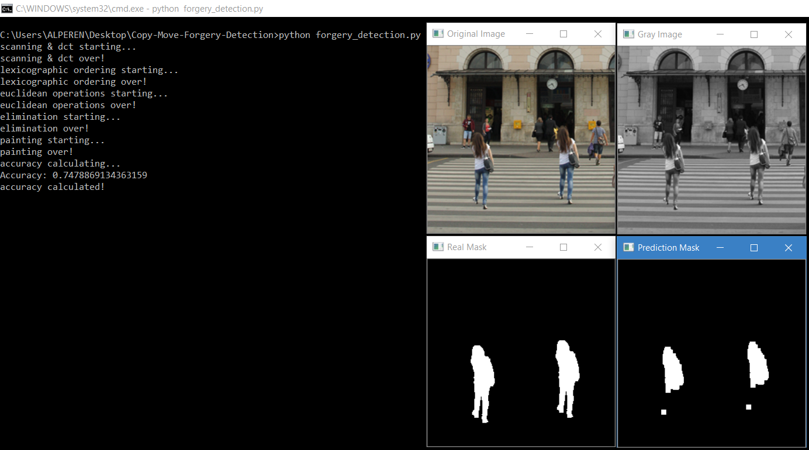

# Copy Move Forgery Detection

### Summary:

DCT-based detection of copy-move forgery in images.

### Requirements:

- Python3 (3.6.8 Recommended)
- OpenCV (pip install opencv-python)
  
### How to Run:

- python forgery_detection.py

### Outputs:

---

**Alperen Cubuk**